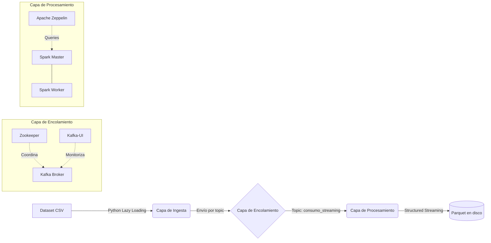

# Memoria Técnica: Sistema Distribuido para Ingesta y Análisis de Consumo Eléctrico en Streaming

**Proyecto Final Ampliado**
**Asignatura:** Ingeniería de Datos: Big Data
**Autores:** Jesús Solís Ortega y Nicolás Herrera Lobo
**Fecha de entrega:** [Fecha]

---

## Resumen Ejecutivo

Este documento describe el diseño, arquitectura e implementación de un pipeline de datos orientado al procesamiento en streaming. El caso de uso es la ingesta de registros de consumo eléctrico del dataset Endesa Agregada (+364 MB), que simula el comportamiento de contadores inteligentes. El sistema combina Apache Kafka para la recepción de eventos, Apache Spark Structured Streaming para el procesamiento, y Apache Zeppelin para el análisis de los datos persistidos, todo orquestado mediante Docker Compose.

---

## 1. Arquitectura y Tecnologías

La arquitectura se despliega íntegramente en contenedores Docker, comunicados a través de una red bridge interna llamada `bigdata-network`. Esto garantiza portabilidad y aislamiento del entorno sin depender de instalaciones locales.

El sistema se divide en tres capas:

### 1.1. Capa de Encolamiento

- **Apache Zookeeper**: Gestiona la coordinación y el estado del clúster Kafka.
- **Apache Kafka**: Broker central que recibe los eventos del productor y los sirve a los consumidores. Usa el topic `consumo_streaming` para desacoplar la ingesta del procesamiento: si Spark se cae, Kafka retiene los mensajes y no se pierden datos.

### 1.2. Capa de Procesamiento

- **Apache Spark Master / Worker**: Clúster standalone que ejecuta el job de Structured Streaming. El master coordina y el worker ejecuta las transformaciones.
- **Apache Zeppelin**: Interfaz de notebooks conectada al clúster Spark. Se usa para consultar los datos ya persistidos en Parquet mediante Spark SQL.

### 1.3. Monitorización

- **Kafka-UI**: Panel web que muestra en tiempo real el estado del broker, los topics y el flujo de mensajes.

---

## 2. Diseño del Productor

El productor (`productor.py`) lee el CSV y envía cada línea como un mensaje al topic de Kafka. Dado el tamaño del dataset (364 MB), se tomaron varias decisiones de diseño:

1. **Lazy Loading**: Se lee el fichero línea a línea con `with open()`, sin cargarlo entero en memoria. Esto permite procesar datasets de cualquier tamaño sin riesgo de OOM.

2. **Logging estructurado**: Se usa el módulo `logging` de Python con formato de timestamp, nivel de severidad y nombre del componente. Se emite un log cada 1000 eventos con el contador acumulado.

3. **Graceful Shutdown**: Se captura la señal `SIGINT` (Ctrl+C) para cerrar la conexión limpiamente, haciendo un `flush()` antes de salir y evitando mensajes en tránsito que no lleguen al broker.

4. **Throttling**: Se introduce un retardo de 5ms entre envíos (`time.sleep(0.005)`) para no saturar el broker con ráfagas de mensajes y simular un comportamiento más realista de dispositivos IoT. Con 50.000 registros esto supone unos 4-5 minutos de ingesta.

---

## 3. Decisiones de Infraestructura

El principal reto fue hacer funcionar el clúster (Zookeeper, Kafka, Spark Master, Spark Worker y Zeppelin) en una máquina de desarrollo con 16 GB de RAM. Para evitar que el sistema operativo mate procesos por falta de memoria, se establecieron límites explícitos:

- Kafka: `KAFKA_HEAP_OPTS: "-Xmx512m -Xms512m"` — suficiente para el rol de broker de paso.
- Spark daemon: `SPARK_DAEMON_MEMORY=512m` para los procesos de gestión.
- Spark Worker: `SPARK_WORKER_MEMORY=2g` para las transformaciones en memoria.
- Zeppelin: `mem_limit: 2g` a nivel de contenedor Docker.

---

## 4. Job de Spark Structured Streaming

El job (`spark_streaming_job.py`) implementa el procesamiento en tiempo real:

1. **Lectura de Kafka**: Se suscribe al topic `consumo_streaming` desde el offset más antiguo (`startingOffsets: earliest`).

2. **Parseo del CSV**: Cada mensaje es una línea cruda del CSV. Se parte por comas y se extrae el esquema completo: `cups`, `periodo`, `tarifa`, `provincia`, `municipio`, 24 columnas de consumo activo (`h1..h24`) y 24 de consumo reactivo (`r1..r24`).

3. **Transformaciones por micro-batch** (cada 10 segundos):
   - `consumo_activo_total_wh`: suma de `h1` a `h24`.
   - `consumo_reactivo_total_varh`: suma de `r1` a `r24`.
   - `anyo` y `mes`: extraídos del campo `periodo` (formato YYYYMM).

4. **Escritura en Parquet**: Los datos se persisten en `data/parquet_output/` con compresión Snappy, particionados físicamente por `anyo/mes`. El checkpoint en `data/checkpoints/` permite reanudar el job desde donde se quedó si se interrumpe.

---

## 5. Resultados

El pipeline se validó end-to-end con 50.000 registros del dataset real. Los datos procesados se consultaron mediante el notebook de Zeppelin, que incluye 11 queries analíticas:

- Distribución de consumo por año y mes.
- Comparativa entre tarifas T1 y T2.
- Top 10 provincias por consumo total.
- Curva de carga horaria media (perfil de consumo a lo largo del día).
- Top 10 consumidores individuales.
- Ratio de consumo reactivo vs activo.
- Detección de contadores inactivos (consumo = 0).
- Pico y valle de consumo por hora.
- Segmentación por tramos de consumo.

La arquitectura desacoplada (Kafka como buffer intermedio) permite que productor y consumidor operen de forma independiente. Si el job de Spark se detiene, Kafka retiene los mensajes y el procesamiento puede reanudarse sin pérdida de datos.

---

## 6. Hitos del Proyecto

### Fase I: Infraestructura e Ingesta [Completado]

- Clúster Docker con todos los servicios y red compartida.
- Productor Kafka con lazy loading, throttling y shutdown limpio.
- Consumidor de verificación para comprobar que los mensajes llegan al broker.

### Fase II: Procesamiento y Análisis [Completado]

- Job Spark Structured Streaming que lee de Kafka, transforma y persiste en Parquet.
- Notebook Zeppelin con 11 queries sobre los datos persistidos.
- Scripts de arranque (`start.sh`) y parada (`stop.sh`) para simplificar la ejecución.
