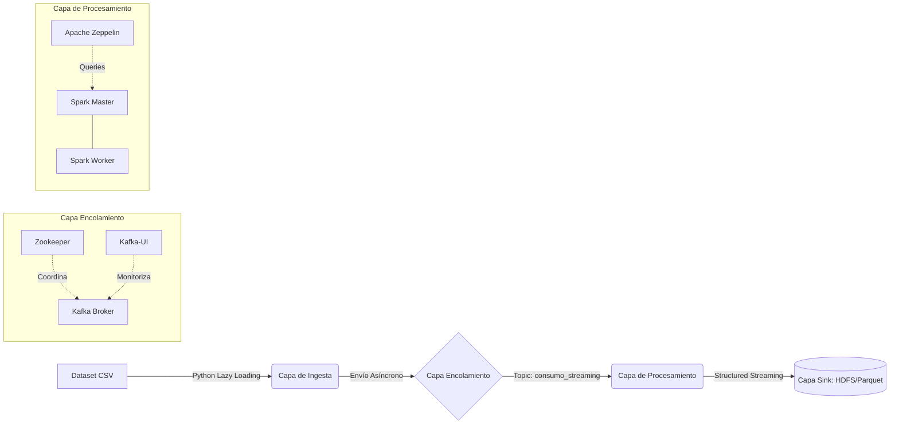

# Memoria Técnica: Sistema Distribuido para Ingesta y Análisis de Consumo Eléctrico en Streaming

**Proyecto Final Ampliado**
**Asignatura:** Ingeniería de Datos: Big Data
**Autores:** Jesús Solís Ortega y [Nombre y Apellidos de Nico]
**Fecha de entrega:** [Fecha]

---

## Resumen Ejecutivo

El presente documento técnico detalla el diseño, arquitectura y fase de implementación inicial de un Data Pipeline (tubería de datos) robusto, orientado al procesamiento de eventos en tiempo real (*Streaming*). El caso de uso se centra en la ingesta masiva de registros de consumo eléctrico (Dataset *Endesa Agregada*, +364 MB), simulando el comportamiento de contadores inteligentes (Smart Meters). El sistema integra tecnologías punta del ecosistema Big Data: **Apache Kafka** como bus de mensajería distribuida y **Apache Spark** como motor de procesamiento analítico (Structured Streaming), todo ello orquestado bajo contenedores **Docker** y monitorizado mediante interfaces de Data Observability (**Kafka-UI** y **Apache Zeppelin**).

---

## 1. Diseño Arquitectónico y Tecnologías

Para garantizar la inmutabilidad, portabilidad y aislamiento del entorno, la arquitectura se ha desplegado íntegramente sobre la tecnología de virtualización de contenedores (Docker Engine), comunicando los nodos a través de una subred tipo *bridge* aislada denominada `bigdata-network`.

El ecosistema se distribuye en tres grandes capas lógicas:

### 1.1. Capa de Encolamiento (*Message Broker*)
*   **Apache Zookeeper (Quorum Manager)**: Componente vital encargado de mantener el estado de configuración, sincronizaciones y gestión de consenso dentro de la red del bróker.
*   **Apache Kafka (Broker Node)**: Nodo central de ingesta que actúa como un *buffer* o amortiguador de ráfagas para el flujo de datos masivos. Maneja el Topic `consumo_streaming`, permitiendo la persistencia temporal de los mensajes y desacoplando al productor de los consumidores finales.

### 1.2. Capa de Procesamiento y Analítica (*Processing Engine*)
*   **Apache Spark Master / Worker**: Motor central que despliega un clúster *standalone* para ejecutar las reglas matemáticas y agregaciones analíticas mediante *Spark Structured Streaming*.
*   **Apache Zeppelin**: Entorno de libretas interactivas (Notebooks) habilitado para construir demostraciones interactivas y diseñar de forma iterativa el modelado dimensional y de limpieza técnica a través de Spark SQL.

### 1.3. Capa de Supervisión (*Data Observability*)
*   **Kafka UI**: Herramienta de auditoría y monitorización gráfica. Su inclusión eleva la profesionalidad del despliegue, permitiendo verificar en vivo el *throughput* (mensajes por segundo), particionado, latencia y salud general del nodo sin necesidad de depender puramente de inspección por consola.

---

## 2. Ingeniería de Datos: Diseño del Productor (*Ingestion Layer*)

La extracción de datos (*ETL - Capa Extract*) desde los archivos CSV originales hacia Kafka ha sido construida ad-hoc mediante Python (`kafka-python`). Debido al gran tamaño estructural del dataset que colapsaría métodos de ingesta tradicionales basados en BATCH (ej: carga en dataframes de *Pandas*), se aplicaron metodologías de diseño resiliente (Resilience Engineering):

1.  **Lectura Desacoplada (Patrón *Lazy Loading*)**:
    El script `productor.py` procesa los datos apoyándose en cursores nativos (bloque `with open`), lo que implica ir transfiriendo las filas desde el sistema de archivos al buffer de red línea a línea sin retener su histórico en la memoria RAM principal.
2.  **Manejo de Trazas (*Logging* Mapeado)**:
    Sustituyendo los primitivos comandos de escritura por consola, el productor integra el módulo estándar `logging`. Se emiten métricas a intervalos predecibles (cada 100 eventos) incluyendo marcas de tiempo exactas (*timestamps*) y severidad (`INFO`, `WARNING`, `ERROR`), posibilitando la indexación de logs futura a través de sistemas como ELK.
3.  **Control de Interrupciones Críticas (*Graceful Shutdown*)**:
    Tratamiento directo nivel SO mediante captura de señal (`signal.SIGINT`). Esta técnica impide que una terminación abrupta (Ctrl+C) corrompa la comunicación TCP, forzando a Kafka a cerrar el socket y lanzar un `producer.flush()`, asegurando que no queden bytes "huérfanos" en tránsito.
4.  **Emisión Suavizada (*Throttling*)**:
    Se inyecta un retardo deliberado de microsegundos (`time.sleep(0.05)`) en el bucle principal. Esto desvanece el pico en el gráfico de red y modela un comportamiento fiel a la realidad de dispositivos IoT (Internet of Things) mandando actualizaciones de estado constantes frente a un volcado repentino de información pura.

---

## 3. Decisiones de Infraestructura y Limitaciones de Hardware

Uno de los principales retos del proyecto ha sido la viabilidad del despilfarrador clúster JVM sobre el que se fundamenta el entorno Big Data (Java Virtual Machines compuestas por Zookeeper, Kafka, Spark Master, Spark Worker y Zeppelin). Todo ello conviviendo en un equipo de desarrollo de capacidades moderadas (Host de 16 GB de RAM).

Para evadir escenarios catastróficos debidos a paginación excesiva de memoria (Swap Thrashing) o recortes de proceso del sistema operativo (OOM Killer), la arquitectura establece **Techados Térmicos Estrictos**:
*   El Broker de Kafka vio limitada su pre-reserva dinámica de espacio a través de `KAFKA_HEAP_OPTS: "-Xmx512m -Xms512m"`. Como Kafka ejerce simplemente de enrutador transitorio dado nuestro paradigma actual de *Throttling*, destinar mayor margen sería un lujo innecesario.
*   En paralelo, los agentes fantasmas subyacentes del Framework Spark confinados bajo `SPARK_DAEMON_MEMORY=512m`, liberando al máximo la ram host, mientras dedicamos lógicamente `SPARK_WORKER_MEMORY=2g` para las reservas activas (transformaciones de analítica In-Memory a la hora de manipular RDDs).

---

## 4. Estado Actual: Hitos y Flujo de Trabajo

El proyecto Big Data aborda un marco Colaborativo (*Pair Work*). La asignación cronológica se distribuye del siguiente modo:

### Fase I: Fundación Arquitectónica e Ingesta Técnica [Completado 100%]
*(Desarrollo responsable de la arquitectura inicial)*
*   Elaboración y aprovisionamiento final del clúster Docker con *Data Observability*.
*   Desarrollo e ingesta algorítmica de la primera etapa del flujo hacia `consumo_streaming`.
*   Resolución de dependencias OS, manejo de variables de entorno (*Twelve-Factor App Configuration*).
*   Test e integridad unitaria comprobada satisfactoriamente mediante monitor de cola (`consumidor.py`).

### Fase II: Procesamiento Masivo y Analítica (*Spark Analytics*) [En Desarrollo]
*(Desarrollo responsable de la Explotación Data Analysis)*
*   Despliegue del motor `Spark Structured Streaming` que leerá como suscriptor permanente (consumer) del tópico de Kafka.
*   Aplicación de Esquema y Reglas de Negocio en DataFrames (`select`, `cast`, ventanas de tiempo, etc).
*   Enrutamiento de consolidación (Sink) escribiendo microbaches en una capa analítica tabular (Lago de Datos). Formato idóneo objetivo: **Parquet** sobre simulación de disco distribuido.
*   Presentación final demostrando los datos persistidos utilizando Queries distribuidas desde *Apache Zeppelin*.

---
**Conclusión: Viabilidad del Framework**
La consolidación de la Fase I aporta un marco elástico y validado, eliminando cualquier componente de fricción derivado de las redes subyacentes. El clúster absorbe fiablemente la carga eléctrica, garantizándole al ecosistema de Analytics de la Fase II la pureza y secuencialidad íntegra en los datos provistos.
